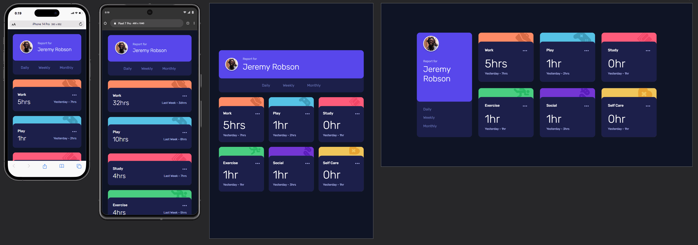

# Time tracking dashboard

### Project

This is a Time tracking dashboard where users can:

- View the optimal layout for the site depending on their device's screen size
- See hover states for all interactive elements on the page
- View real time data pulled from server

### Screenshot

### Links

- Live Site URL: [Time tracking dashboard](https://tomduranti.github.io/time_tracking_dashboard/)

### Built with

- Semantic HTML5
- Sass
- CSS Grid & Flexbox
- BEM
- Responsive & adaptive design
- Cross-browser compatibility
- Mobile-first workflow
- JavaScript
